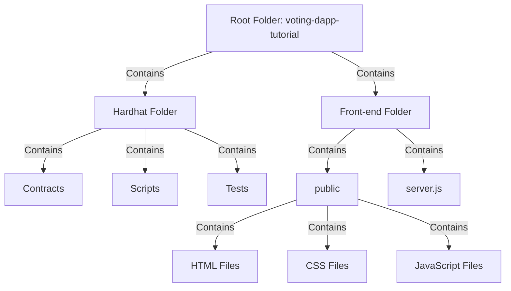
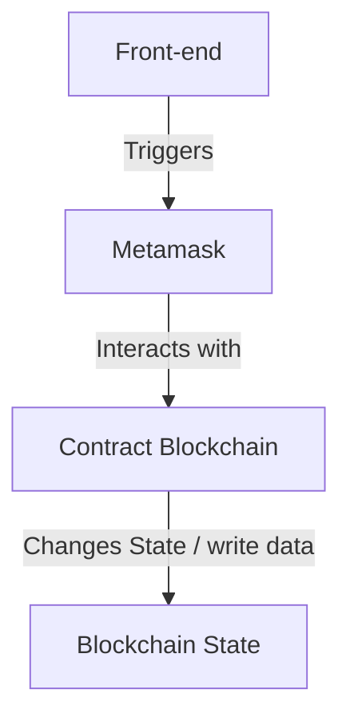
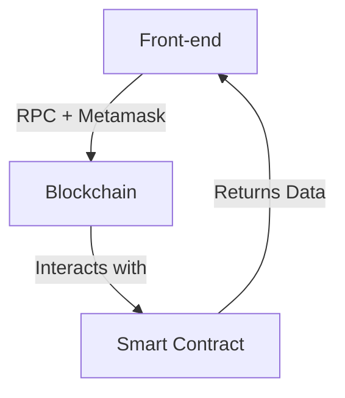
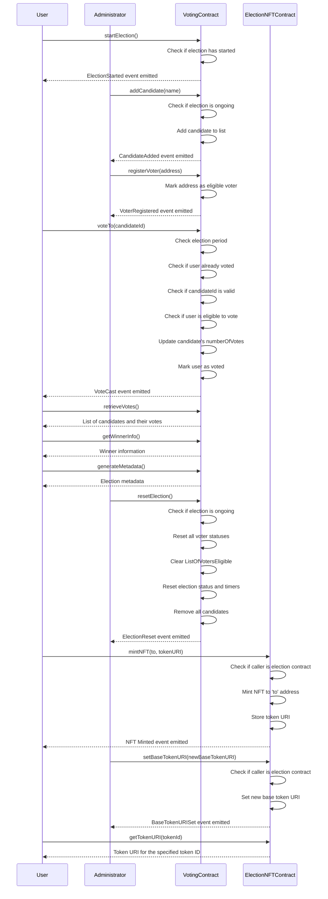

# Blockchain & Solidity Lab1 – Voting dApp Development

### S2BC

<div style="text-align: center;">
  
</div>

---

### Lab 1 - Developing Ethereum Smart Contracts
- **BUILD** / TEST / INTEGRATE / RUN

---

### This Hands on Module will build up of 4 Labs:


1. Developing Ethereum Smart Contracts [**BUILD**]

2. Test Ethereum Smart Contracts [TEST]

3. Integrate Smart Contracts with Web3 and establish and run your 1st dApp [INTEGRATE]

4. Run a dApp and considering next steps to create a possible contribution [RUN]

---

## Prerequisites

To make the most out of this lab, a basic understanding of programming concepts and familiarity with JavaScript will be beneficial. However, even if you're new to blockchain development, we'll guide you through each step.

Let's dive in and get started with the first part of our journey: Developing Ethereum Smart Contracts!

---
## dApp structure Overview


## Flow overview


---


## Overview contract Voting.sol

### Diagram of interactions




## To Set Up the Development Environment
### SETUP DEVELOPMENT ENVIRONMENT ON MORPHEUSLABS BPAAS SEED
<!--  add setup -->


## DEVELOPING ETHEREUM SMART CONTRACTS

We will start this hands-on development course with a smart contract that aims to solve a
problem of traditional centralized voting platforms.

### What is the problem?

Traditional centralized voting systems pose significant security risks and lack transparency. It's challenging to provide concrete evidence of their security measures. Moreover, a central authority can potentially manipulate results, eroding trust in the electoral process.


### What is the solution?

Integrating cryptocurrencies and smart contracts offers a robust solution to address these challenges. This approach empowers supporters by involving them directly in the development and decision-making processes of the projects they choose to back, ensuring transparency and security in the voting system.


### How will it work?

- **Administrator Role:** An administrator has the authority to initiate an election by specifying candidates, setting a defined time duration, and registering eligible voters. 

- **Voter Registration:** Registered voters are allowed to cast a single vote within the election period.

- **Dynamic Updates:** The administrator retains the flexibility to add candidates and adjust the voting duration as necessary, even after the election has started.

- **Timer Expiry:** Once the timer reaches zero, voting is automatically closed, preventing further participation.

- **End Election:** The administrator can formally conclude the election process, signaling that no more votes can be cast.

- **Result Minting:** After concluding the election, the administrator can initiate the "minting" process, creating unique NFTs for each voter. These NFTs will serve as proof of the winner of the election.

- **Election Reset:** The administrator can choose to reinitialize the election, starting a fresh cycle for a new round of voting.

- **Result Verification:** The NFT collection acts as an immutable record, providing a time-stamped, verifiable history of all transactions within the voting system.

This comprehensive system ensures transparency, security, and integrity throughout the entire voting process, bolstered by the use of NFTs to memorialize the results and actions taken.

### ELEMENTS OF THE APP

#### Variables:

- `electionNFTContract`: Address of the ElectionNFT contract.
- `electionID`: Unique identifier for each election.
- `candidates`: Array holding candidate details, including their ID, name, and the number of votes received.
- `owner`: Address of the contract owner.
- `voters`: Mapping of voter addresses to their voting status.
- `eligibleVoters`: Mapping of addresses eligible to vote.
- `ListOfVoters`: Internal list of addresses who have participated in the election.
- `ListOfVotersEligible`: Internal list of addresses eligible to vote.
- `votingStartTimeStamp`: Timestamp when the voting period starts.
- `votingEndTimeStamp`: Timestamp when the voting period ends.
- `electionStarted`: Status indicating if an election is in progress.

#### Functions:

- `onlyOwner`: Modifier restricting certain functions to be executed only by the contract owner.
- `electionOnGoing`: Modifier ensuring that an election is currently in progress.

- `startElection(_candidates, _votingDuration)`: Function to initiate an election, specifying candidates and duration.
- `voterStatus(_voter)`: Function to check if a voter has already cast their vote.
- `voteTo(_id)`: Function for voters to cast their votes.
- `retrieveVotes()`: Function to get the number of votes received by each candidate.
- `electionTimer()`: Function to monitor the remaining time for the ongoing election.
- `checkElectionPeriod()`: Function to verify if the election period is still ongoing.
- `resetAllVoterStatus()`: Function to reset the status of all voters.
- `resetElection()`: Function to completely reset the entire election process.
- `endElection()`: Function to conclude an ongoing election.
- `removeCandidate(_candidateId)`: Function to remove a candidate from the list.
- `removeAllCandidates()`: Function to remove all candidates.
- `transferOwnership(newOwner)`: Function to transfer ownership of the contract.
- `changeElectionDuration(_newDuration)`: Function to change the duration of the ongoing election.
- `addCandidate(_name)`: Function to add a new candidate.
- `registerVoter(_eligible_voter)`: Function to register a voter.
- `registerVoters(_eligible_voters)`: Function to register multiple voters.
- `mintResultNFTs(_tokenURI)`: Function to mint NFTs for election results.
- `mintResult(_participant, _tokenURI)`: Function to mint an NFT for a participant.
- `setElectionNFTContract(_electionNFTContract)`: Function to set the address of the ElectionNFT contract.

- `getWinnerInfo()`: Function to get information about the winner of the election.
- `generateMetadata()`: Function to generate metadata for the election results.

---

### A BRIEF INTRODUCTION TO SOME PROGRAMMING BASICS (SKIP, IF YOU HAVE SOME CODING EXPERIENCE)

#### Introduction to Command Line

Chances are, you're working on a computer powered by a Linux, Mac, or Windows Operating System. Mastering the command line is pivotal for the tasks ahead. While you may write your code in editors like Microsoft Visual Studio Code or use Remix for Solidity smart contracts, the command line is indispensable for executing and testing your programs, even on the Morpheus Labs Platform. It's a versatile tool, with one of its primary roles being to leverage the npm package manager for installing necessary packages.

If you're using Windows, you might want to consider using Ubuntu Linux on Windows Subsystem for Linux (WSL) for a smoother experience. WSL provides a Linux environment within your Windows system, greatly benefiting blockchain development.

- **For Linux**: Open the terminal. (Shortcut: CTRL+ALT+T)

- **For Windows (with Ubuntu on WSL)**: Launch the WSL terminal.

- **For Mac**: Utilize the terminal.

- **On Morpheus Labs SEED BPaaS**: Access the terminal. (Ubuntu docker)


#### Navigating your file system

When navigating your file system, keep these commands in mind:


- `cd ..`: Move up one directory level.
- `cd <folder name>`: Enter a specific folder.
- `ls`: List files and folders in the current directory.
- `ls -a`: List all files and folders, including hidden ones.
- `cat <file name>`: Display the contents of a file.
- `touch <file name>`: Create a new file.
- `mkdir <folder name>`: Create a new folder.
- `rm <file name>`: Remove a file (be cautious, this action is irreversible).
- `rm -r <folder name>`: Remove a folder and its contents.
- `mv <source> <destination>`: Move or rename files and folders.
- `cp <source> <destination>`: Copy files or folders.
- `pwd`: Display the current working directory.
- `clear`: Clear the terminal screen.
- `history`: Display a list of recently used commands.
- `grep <pattern> <file>`: Search for a specific pattern in a file.
- `chmod <permissions> <file>`: Change the permissions of a file.
- `nano <file name>`: Open the Nano text editor to edit a file.
- `wget <URL>`: Download a file from the internet.
- `curl <URL>`: Transfer data from or to a server.

Once you're in the desired folder, you can run your program by typing `<program name>` in the command line. NPM, a potent package manager, will be your go-to tool for installing, updating, and removing packages like Hardhat, ethers, Express...


#### Introduction to Basic Programming Concepts

##### Variables and Constants

In programming, variables and constants are essential components. They are used to store and manipulate data. 

- **Variables**: These are containers that can hold various types of data, such as strings, integers, or booleans (true/false). The value of a variable can be changed during the execution of a program.

    ```javascript
    let name = "John"; // Here, 'name' is a variable storing a string value "John".
    let age = 30;      // 'age' is a variable storing an integer value 30.
    let isStudent = true; // 'isStudent' is a variable storing a boolean value true.
    ```

- **Constants**: Unlike variables, constants hold fixed values that do not change during the execution of a program.

    ```javascript
    const PI = 3.14; // Here, 'PI' is a constant with a fixed value of 3.14.
    const MAX_SIZE = 100; // 'MAX_SIZE' is a constant with a fixed value of 100.
    ```

##### Data Structures

Understanding data structures is crucial for efficient data management in programming. Here are some common data structures:

- **Array**: An array is defined within square brackets `[]`. It can hold multiple values, each separated by commas. 

    ```javascript
    let numbers = [1, 2, 3, 4, 5]; // 'numbers' is an array containing five integers.
    let names = ["Alice", "Bob", "Charlie"]; // 'names' is an array containing three strings.
    ```

- **Object (Dictionary)**: An object is defined within curly braces `{}`. It consists of key-value pairs, where each piece of data is mapped to a specific value. 

    ```javascript
    let person = {
        name: "John",
        age: 30,
        isStudent: false
    }; // 'person' is an object with name, age, and isStudent as keys and their respective values.
    ```

##### Functions

Functions play a vital role in programming. They take input values, process them, and return a result. Functions are defined with a name, input parameters within parentheses `()`, and the code to be executed within curly braces `{}`. 

They can be called by using the function name and providing the necessary input values. 

```javascript
function addNumbers(num1, num2) {
    return num1 + num2;
}

let result = addNumbers(5, 3); // 'result' will be 8.
```

##### Classes

Classes are fundamental to object-oriented programming (OOP). They encapsulate data and functions into a single unit. A class can contain multiple functions that define the behavior of objects created from that class.

Certainly! Here's the completed section you can include before creating the contract:


## Set up main repo

To get started with our decentralized voting application tutorial, we'll first set up the main repository. Follow these steps:

### Step 1: Create a Folder

Open a terminal and execute the following commands to create a new folder for our project:

```bash
mkdir voting-dapp-tutorial
cd voting-dapp-tutorial
touch README.md
```

This will create a new directory named `voting-dapp-tutorial` and a `README.md` file, which will serve as the main documentation for our project.

### Step 2: Install HardHat

Next, we'll install HardHat, a popular development environment for Ethereum. HardHat provides a set of tools that make it easy to compile, deploy, and test smart contracts. Execute the following command to install HardHat:

```bash
npx install hardhat
```

lunch VSCode
```
code .
```

```
cd hardhat
```

This command will fetch and set up the HardHat environment in our project directory.

With these initial steps completed, we're now ready to proceed with the creation of our smart contract for the decentralized voting system. Let's move on to the next section!


## CREATING THE `Voting.sol` FILE

In this section, we'll guide you through the process of creating the `Voting.sol` file, which will house the smart contract for our decentralized voting application. This Solidity file will define the behavior and rules of our voting system on the Ethereum blockchain.

- into hardhat/contracts folder, create a new file named Voting.sol

### Step 1: Set the Compiler Version and Import Dependencies

Open your preferred code editor and create a new file named `Voting.sol`. At the top of the file, specify the Solidity compiler version and import any necessary dependencies. In our case, we're importing the `ElectionNFT.sol` contract, which will handle the creation of unique NFTs for each voter.

```solidity
// SPDX-License-Identifier: UNLICENSED
pragma solidity ^0.8.19;
import "./ElectionNFT.sol"; //this is the import of the futur NFT contract

contract Voting {
    // ... (content of the Voting.sol contract)
}
```

### Step 2: Define the Contract Structure

Within the `Voting.sol` file, we'll define the structure of our smart contract. This includes declaring variables, creating functions, and implementing modifiers. The content of the contract will be placed within the curly braces `{}`.


---

## Step 3: Implementing the Voting System Logic

In this step, we will dive into the actual implementation of the decentralized voting system. This encompasses defining essential data structures, setting up administrator roles, managing candidates, registering voters, and orchestrating the entire voting process.

### Defining Data Structures

We begin by defining the necessary data structures that will facilitate the functioning of our voting system.

```solidity
contract Voting {
    address public electionNFTContract;

    // Define data structures, modifiers, and events

    struct Candidate {
        uint256 id;
        string name;
        uint256 numberOfVotes;
    }

    uint256 public electionID = 0;
    Candidate[] public candidates;
    address public owner;
    // ... (more variables)
}
```

Here, we've declared a `Candidate` struct to represent each individual in the election. It includes an ID, a name, and a count of their received votes. Additionally, we have variables like `electionID`, `candidates`, and `owner` that will be crucial throughout the process.

### Setting Access Modifiers

Access modifiers are essential for controlling who can execute certain functions. We'll use modifiers to restrict access to specific actions.

```solidity
    modifier onlyOwner() {
        // Modifier code to restrict access
    }

    modifier electionOnGoing() {
        // Modifier code to check if election is ongoing
    }
```

The `onlyOwner` modifier ensures that certain functions can only be executed by the contract owner. The `electionOnGoing` modifier verifies if an election is currently in progress.

### Declaring Events

Events in Solidity allow smart contracts to communicate information to external consumers. We'll define events to signal important occurrences in our voting system.

```solidity
    event ElectionStarted(
        address indexed owner,
        uint256 startTimestamp,
        uint256 endTimestamp
    );
    // ... (more events)
```

For instance, the `ElectionStarted` event will be emitted when a new election commences, providing details like the owner's address and the start/end timestamps.

### Implementing Functions

We'll create functions to perform crucial tasks, such as initiating an election, registering voters, casting votes, and more.

```solidity
    function startElection(string[] memory _candidates, uint256 _votingDuration) 
        public 
        onlyOwner 
    {
        // Function code to start an election
    }

    // ... (more functions)
```

The `startElection` function, for instance, allows the owner to kickstart a new election by specifying candidate names and the voting duration.

### Conclusion

With this step, we've laid the foundation for our decentralized voting system. The defined data structures, modifiers, events, and functions form the core logic of our contract. In the subsequent steps, we'll continue to build upon this foundation, adding more functionalities and fine-tuning the system.

Next, we'll explore additional features like managing candidates, registering voters, and handling the voting process.

### Full Voting.sol contract code

Your smart contract Voting.sol should looks like this:

```solidity

// SPDX-License-Identifier: UNLICENCED
pragma solidity ^0.8.19;
import "./ElectionNFT.sol";

contract Voting {
    address public electionNFTContract;

    // Create a structure template for each candidates
    struct Candidate {
        uint256 id; // Unique identifier for the candidate
        string name; // Name of the candidate
        uint256 numberOfVotes; // Number of votes received by the candidate
    }

    // Election ID ( is never deleted and increment at every starting new election )
    uint256 public electionID = 0;

    // List of all candidates
    Candidate[] public candidates;

    // This will be the owner's address
    address public owner;

    // Mapp all voter addresses
    mapping(address => bool) public voters;
    mapping(address => bool) public eligibleVoters;

    // List of voters
    address[] internal ListOfVoters;
    address[] internal ListOfVotersEligible;

    // voting start and end session
    uint256 public votingStartTimeStamp;
    uint256 public votingEndTimeStamp;

    // Create an election status
    bool public electionStarted;

    // Restrict creating vote to the owner only
    modifier onlyOwner() {
        require(msg.sender == owner, "not authorized to start election");
        _;
    }

    // Check if an election is ongoing
    modifier electionOnGoing() {
        require(electionStarted, "no election yet");
        _;
    }

    // Event emitted when the election starts
    event ElectionStarted(
        address indexed owner,
        uint256 startTimestamp,
        uint256 endTimestamp
    );

    // Event emitted when a vote is cast
    event VoteCast(address indexed voter, uint256 candidateId);

    // Event emitted when a new Candidate is added
    event CandidateAdded(uint256 indexed id, string name);

    // Event emitted when time has been added to the election period
    event ElectionDurationChanged(uint256 newDuration);

    // Event emitted when the election finishes
    event ElectionFinished(address indexed owner);

    // Event emitted when the election is reset
    event ElectionReset(address indexed owner);

    constructor() {
        // Initialize owner
        owner = msg.sender;
    }

    // To start an election
    function startElection(string[] memory _candidates, uint256 _votingDuration)
        public
        onlyOwner
    {
        require(electionStarted == false, "Election is currently ongoing");

        // Increment electionID
        electionID += 1;

        // Clear existing candidates
        while (candidates.length > 0) {
            removeCandidate(0);
        }

        // Add new candidates
        for (uint256 i = 0; i < _candidates.length; i++) {
            candidates.push(
                Candidate({id: i, name: _candidates[i], numberOfVotes: 0})
            );
        }
        electionStarted = true;
        votingStartTimeStamp = block.timestamp;
        votingEndTimeStamp = block.timestamp + (_votingDuration * 1 minutes);

        emit ElectionStarted(owner, votingStartTimeStamp, votingEndTimeStamp);
    }

    // Check voter's status
    function voterStatus(address _voter)
        public
        view
        electionOnGoing
        returns (bool)
    {
        if (voters[_voter] == true) {
            return true;
        }
        return false;
    }

    // To vote function
    function voteTo(uint256 _id) public electionOnGoing {
        require(checkElectionPeriod(), "Election period has ended");
        require(
            !voterStatus(msg.sender),
            "You already voted. You can only vote once."
        );
        require(_id < candidates.length, "Invalid candidate ID");
        require(eligibleVoters[msg.sender], "You are not an eligible voter.");

        candidates[_id].numberOfVotes++;
        voters[msg.sender] = true;

        // Add to the has voted voters list
        ListOfVoters.push(msg.sender);

        emit VoteCast(msg.sender, _id);
    }

    // Get the number of votes
    function retrieveVotes() public view returns (Candidate[] memory) {
        return candidates;
    }

    // Monitor the election time
    function electionTimer() public view returns (uint256) {
        if (block.timestamp >= votingEndTimeStamp) {
            return 0;
        }
        return (votingEndTimeStamp - block.timestamp);
    }

    // Check if election period is still ongoing
    function checkElectionPeriod() public view returns (bool) {
        return electionTimer() > 0;
    }

    // Reset all voters status
    function resetAllVoterStatus() public onlyOwner {
        for (uint256 i = 0; i < ListOfVoters.length; i++) {
            voters[ListOfVoters[i]] = false;
        }
        delete ListOfVoters;

        emit ElectionReset(owner);
    }

    // Completely resetting the entire election process
    function resetElection() public onlyOwner {
        require(!electionStarted, "Election is currently ongoing");

        // Reset ListOfVotersEligible mappings
        for (uint256 i = 0; i < ListOfVotersEligible.length; i++) {
            eligibleVoters[ListOfVotersEligible[i]] = false;
        }

        // Clear ListOfVotersEligible
        delete ListOfVotersEligible;

        // Reset voter status
        resetAllVoterStatus();

        // Reset election status and timers
        electionStarted = false;
        votingStartTimeStamp = 0;
        votingEndTimeStamp = 0;

        // Remove all candidates
        removeAllCandidates();

        // emit Election Reset
        emit ElectionReset(owner);
    }

    function endElection() public onlyOwner electionOnGoing {
        electionStarted = false;
        votingEndTimeStamp = block.timestamp;

        emit ElectionFinished(owner);
    }

    function removeCandidate(uint256 _candidateId) public onlyOwner {
        require(_candidateId < candidates.length, "Invalid candidate ID");
        require(!electionStarted, "Election is ongoing");

        for (uint256 i = _candidateId; i < candidates.length - 1; i++) {
            candidates[i] = candidates[i + 1];
        }

        delete candidates[candidates.length - 1];
        candidates.pop();
    }

    function removeAllCandidates() public onlyOwner {
        require(!electionStarted, "Election is currently ongoing");
        while (candidates.length > 0) {
            removeCandidate(0);
        }
    }

    function transferOwnership(address newOwner) public onlyOwner {
        require(newOwner != address(0), "Invalid new owner address");
        owner = newOwner;
    }

    function changeElectionDuration(uint256 _newDuration)
        public
        onlyOwner
        electionOnGoing
    {
        require(_newDuration > 0, "Invalid duration");

        votingEndTimeStamp = votingStartTimeStamp + (_newDuration * 1 minutes);

        emit ElectionDurationChanged(_newDuration);
    }

    function addCandidate(string memory _name)
        public
        onlyOwner
        electionOnGoing
    {
        candidates.push(
            Candidate({id: candidates.length, name: _name, numberOfVotes: 0})
        );

        emit CandidateAdded(candidates.length - 1, _name);
    }

    function registerVoter(address _eligible_voter) public onlyOwner {
        eligibleVoters[_eligible_voter] = true;
        ListOfVotersEligible.push(_eligible_voter); // Add the voter to the ListOfVotersEligible
    }

    function registerVoters(address[] memory _eligible_voters)
        public
        onlyOwner
    {
        for (uint256 i = 0; i < _eligible_voters.length; i++) {
            eligibleVoters[_eligible_voters[i]] = true;
            ListOfVotersEligible.push(_eligible_voters[i]);
        }
    }

    function mintResultNFTs(string memory _tokenURI) public onlyOwner {
        require(!electionStarted, "Election is ongoing, cannot mint NFTs yet");
        require(
            votingStartTimeStamp != 0,
            "Timestamp is 0, election not even started"
        );
        for (uint256 i = 0; i < ListOfVoters.length; i++) {
            // Mint NFT to each voter
            ElectionNFT(electionNFTContract).mintNFT(
                ListOfVoters[i],
                _tokenURI
            );
        }
    }

    function mintResult(address _participant, string memory _tokenURI)
        public
        onlyOwner
    {
        require(!electionStarted, "Election is ongoing, cannot mint NFTs yet");
        require(
            votingStartTimeStamp != 0,
            "Timestamp is 0, election not even started"
        );
        // Mint an NFT for the participant
        ElectionNFT(electionNFTContract).mintNFT(_participant, _tokenURI);

        // Mark the participant as having received an NFT
        voters[_participant] = true;
    }

    // Function to set ElectionNFT contract address
    function setElectionNFTContract(address _electionNFTContract)
        public
        onlyOwner
    {
        electionNFTContract = _electionNFTContract;
    }

    // Structure template for election metadata
    struct ElectionMetadata {
        uint256 electionID;
        uint256 winnerID;
        string winnerName;
        uint256 numberOfVotes;
        uint256 startTime;
        uint256 endTime;
    }

    struct Winner {
    uint256 candidateID;
    string name;
    uint256 numberOfVotes;
    uint256 electionID;
}

    function getWinnerInfo() public view returns (Winner memory) {
    require(!electionStarted, "Election is still ongoing");
    require(candidates.length > 0, "No candidates available");

    uint256 maxVotes = 0;
    uint256 winningCandidateIndex;

    for (uint256 i = 0; i < candidates.length; i++) {
        if (candidates[i].numberOfVotes > maxVotes) {
            maxVotes = candidates[i].numberOfVotes;
            winningCandidateIndex = i;
        }
    }

    Winner memory winner = Winner({
        candidateID: candidates[winningCandidateIndex].id,
        name: candidates[winningCandidateIndex].name,
        numberOfVotes: maxVotes,
        electionID: electionID
    });

    return winner;
}


   
    

 function generateMetadata()
    public
    view
    returns (ElectionMetadata memory)
{
    require(!electionStarted, "Election is still ongoing");
    require(candidates.length > 0, "No candidates available");

    uint256 maxVotes = 0;
    uint256 winningCandidateIndex;

    for (uint256 i = 0; i < candidates.length; i++) {
        if (candidates[i].numberOfVotes > maxVotes) {
            maxVotes = candidates[i].numberOfVotes;
            winningCandidateIndex = i;
        }
    }

    Winner memory winner = Winner({
        candidateID: candidates[winningCandidateIndex].id,
        name: candidates[winningCandidateIndex].name,
        numberOfVotes: maxVotes,
        electionID: electionID
    });

    // Create ElectionMetadata struct
    ElectionMetadata memory metadata = ElectionMetadata({
        electionID: electionID,
        winnerID: winner.candidateID,
        winnerName: winner.name,
        numberOfVotes: winner.numberOfVotes,
        startTime: votingStartTimeStamp,
        endTime: votingEndTimeStamp
    });

    return metadata;
}
}


```

### CREATING THE ElectionNFT.SOL FILE


In this section, we'll guide you through the process of creating the `ElectionNFT.sol` file, which will handle the creation of unique NFTs for each voter in our decentralized voting application.

Create a new file named `ElectionNFT.sol` and paste the following code:

### Full ElectionNFT.sol contract code


```solidity
// SPDX-License-Identifier: UNLICENSED
pragma solidity ^0.8.19;

import "@openzeppelin/contracts/token/ERC721/ERC721.sol";

contract ElectionNFT is ERC721 {
    address public electionContractAddress;
    uint256 public electionId;
    uint256 private tokenIdCounter;
    string private baseTokenURI;
    mapping(uint256 => string) private tokenURIs;

    constructor(address _electionContractAddress) ERC721("Election NFT", "ENFT") {
        electionContractAddress = _electionContractAddress;
    }

    function _baseURI() internal view virtual override returns (string memory) {
        return baseTokenURI;
    }

    function setBaseTokenURI(string memory _newBaseTokenURI) external {
        require(msg.sender == electionContractAddress, "Only the election contract can set base URI");
        baseTokenURI = _newBaseTokenURI;
    }

    function mintNFT(address _to, string memory _tokenURI) external {
        require(msg.sender == electionContractAddress, "Only the election contract can mint NFTs");
        _safeMint(_to, tokenIdCounter);
        tokenURIs[tokenIdCounter] = _tokenURI;
        tokenIdCounter++;
    }

    function getTokenURI(uint256 _tokenId) external view returns (string memory) {
        return tokenURIs[_tokenId];
    }
}

```


---

### Contact

S2BC

