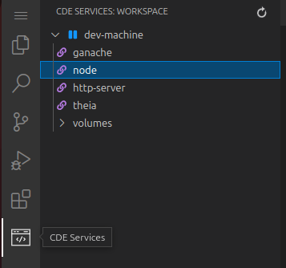

# Blockchain & Solidity Lab4 – Voting dApp Development

### S2BC

<div style="text-align: center;">
  
</div>

---

### Lab 4: Run a dApp and Consider Next Steps
- BUILD / TEST / INTEGRATE / **RUN**

---

So far, you've followed the steps in Labs 1 to 3, gaining valuable insights into the core components of blockchain development. Now, in Lab 4, we will discuss crucial considerations for running a dApp in Morpheus.

## 1. Run the front end

in voting-dapp-2023/frontend run:
```
node server.js (or npm start)
```

This will start the server for your dApp's frontend.

Then, in your IDE interface from Morpheus, find in the left menu the CDE menu and click on the node service in order to open your web app.

<div style="text-align: center;">
  
</div>

## 2. Try the Voting Dapp

- Click on the connect button, a metamask pop up will ask you if you want to connect and then accept with the deployer account imported.

- You can check the Voting status in te Vote Panel:
<div style="text-align: center;">
  
</div>

- Then go the Administrator Panel to Start an election:

<div style="text-align: center;">
  
</div>

add election title, candidates and election duration, then click start election button

Next register voters:
<div style="text-align: center;">
  
</div>

And you should be abble to return to Vote Panel and see the election ongoing information.

Cast a vote.

Then you can end the election by click on "End Election" button in the admin panel.

When election is finished, you can now mint the result with the next "Mint results" Buttun.

When everything is finished, you can reinitialise the Election by clicking on "Rehinitialise" election.

You can as well open you console in the devoloper options of your explorer ( F12 ) to see relative console logs while navigating the app.

## 3. Migrating to Sepolia Testnet and Utilizing Etherscan

To successfully migrate your dApp to the Sepolia Testnet and leverage Etherscan for enhanced visibility, follow the steps below:

### Step 1: Obtain RPC_URL and Etherscan API Key

1.1 Obtain the RPC_URL for Sepolia from Morpheus, Alkemy's website, or Infura.

1.2 Obtain a free Etherscan API Key from the Etherscan website.

### Step 2: Update Configuration Files

2.1 Open your **.env** file and modify the values as follows:

```env
RPC_URL="https://eth-sepolia.g.alchemy.com/v2/APIKEY"
PRIVATE_KEY="00000...000" 
API_KEY="APIKEYFROMETHERSCAN"
```

Ensure the private key corresponds to the deployer account on Sepolia. You can use any account created with Metamask, and acquire testnet ETH from a faucet like Alkemy faucet.

2.2 Update the `chainID` in your `hardhat.config.js` file from 1303 to 11155111.

2.3 In your `frontend/public/script.js` file, replace all occurrences of "1303" with "11155111" to ensure the frontend connects to the Sepolia chainID.

### Step 3: Redeploy the Contract on Sepolia

3.1 Navigate to the hardhat folder in your terminal.

3.2 Run the following command to redeploy the contract on Sepolia:

```bash
npx hardhat run scripts/deploy.js --network sepolia
```

### Step 4: Update Contract Address in Frontend

4.1 Once the deployment is complete, locate the voting contract address.

4.2 Copy the contract address and update the variable in `frontend/public/script.js` as follows:

```javascript
const contractAddress = 'votingcontractaddress';
```

### Step 5: Restart the Server

5.1 Start or restart your server using the following command:

```bash
node frontend/server.js
```

### Step 6: Verification on Etherscan

6.1 If you have chosen to verify your contract on Etherscan, you have two methods available:

#### Method 1: Using Hardhat

To verify your contract using Hardhat, follow these steps:

1. Navigate to your Hardhat directory in the terminal.

2. Run the following command, replacing `<votingcontractaddress>` with the actual address of your deployed contract:

```bash
npx hardhat verify <votingcontractaddress> --network sepolia
```

3. Review the response in the terminal to confirm the success or any output related to the verification process.

4. Check Etherscan to verify if the contract has been successfully verified.

#### Method 2: Using Etherscan Interface

An alternative method is to use the Etherscan interface directly. Provide the following information to Etherscan:

- Contract Code
- Compiler Version
- ABI (Application Binary Interface) of the contract

This method involves interacting with the Etherscan website to manually input the required details for verification.

Choose the method that best fits your workflow or preference. Successful verification ensures transparency and allows users to explore transactions and events within the voting contract on Etherscan, providing detailed insights at each step of the election.

### Step 7: Test the New Setup

7.1 Retry launching a new election on this updated setup to ensure seamless functionality.

By following these steps, your dApp should now be successfully migrated to the Sepolia Testnet, utilizing the specified RPC_URL and providing enhanced insights through Etherscan verification.

## 4. Uploading Your dApp on Morpheus app library to share with community

For detailed steps on uploading your dApp, refer to the [documentation](https://docs.morpheuslabs.io/docs/submit-app-to-the-app-store).

---

<div style="text-align: center;">
  
</div>


