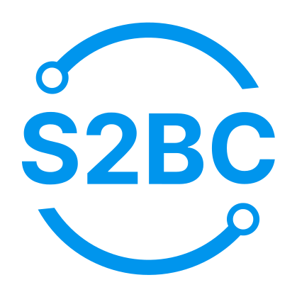
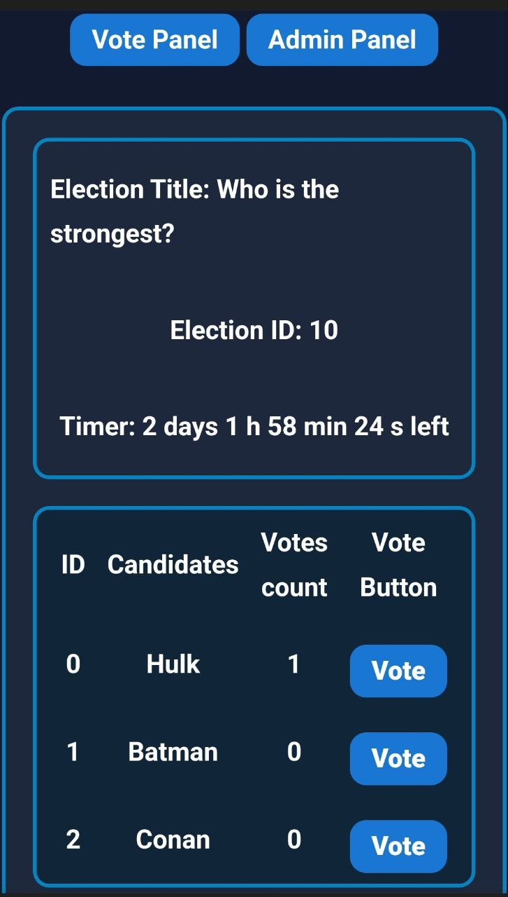

# Blockchain & Solidity Voting dApp Tutorial 101 Documentation

  

#### Video screenshoot :
https://github.com/S2BCBCDev/voting-dapp-tutorial-2023-bis/blob/main/LABxTutorialVotingDapp2023/src/video/document_6325820007565495233.mp4

## Introduction

Welcome to the Blockchain & Solidity Tutorial! This comprehensive tutorial is designed to provide you with a hands-on learning experience in blockchain development using Solidity, JavaScript, and other essential tools. This tutorial will equip you with the knowledge and skills needed to start developing your own decentralized applications (dApps).

## About the Tutorial

This tutorial is divided into four labs, each focusing on a specific aspect of blockchain and Solidity development. From setting up your development environment to integrating web applications with smart contracts, you'll embark on a step-by-step journey to become proficient in blockchain technology.

### **Lab 1 - Developing Ethereum Smart Contracts**

In this lab, you'll learn the fundamentals of Ethereum smart contract development. We'll cover everything from problem-solving with smart contracts to understanding key programming concepts. By the end of this lab, you'll have developed essential smart contracts for your dApp.

### **Lab 2 - Testing Ethereum Smart Contracts with Hardhat**

Testing is a critical aspect of blockchain development. In this lab, you'll dive into testing your Ethereum smart contracts using the powerful Hardhat framework. You'll learn how to write effective test cases to ensure the reliability and security of your contracts.

### **Lab 3 - Integrate Web App with Smart Contracts**

Now that you've mastered smart contract development and testing, it's time to bring your dApp to life! In this lab, we'll guide you through integrating your smart contracts with a user-friendly web application. You'll learn how to create an interactive interface for users to interact with your dApp.

### **Lab 4 - Run a dApp and Consider Next Steps**

Congratulations on reaching the final lab! Here, we'll discuss crucial considerations for running a dApp and planning for its future contributions. You'll learn about data storage, data migration, gas limits, and more. Plus, we'll guide you on how to share your dApp with a wider audience.

## Prerequisites

Before you begin, make sure you have a basic understanding of JavaScript, Node.js, CSS, and HTML. Familiarity with blockchain concepts is a plus but not required.

Now, let's dive into Lab 1 and start building your first Ethereum smart contracts!

## Specifications

### Stack

- Solidity
- HardHat
- Node
- Javascript
- Metamask
- Morpheus
- Oppen Zeppelin
- IPFS
- EVM testnet (private network)

---

## User Stories

### Administrator Perspective

1. **Start Election**
   - *Objective*: Enable the administrator to commence the election for voter participation.
   - *Functional Specification*: Provide an interface allowing the administrator to add candidates, define the voting duration, and initiate the election.

2. **Add Candidates**
   - *Objective*: Allow the administrator to include new candidates in the list.
   - *Functional Specification*: Provide an interface for the administrator to input candidate names.

3. **End Election**
   - *Objective*: Permit the administrator to conclude the election, preventing further votes.
   - *Functional Specification*: Offer an interface for the administrator to officially conclude the election.

4. **View Election Results**
   - *Objective*: Enable the administrator to review the results for the purpose of announcing the winner.
   - *Functional Specification*: Display the candidates along with the respective number of votes they have received.

5. **New Election**
   - *Objective*: Provide the administrator with the ability to delete and start a new election.
   - *Functional Specification*: Furnish an interface allowing the administrator to reset all variables in order to start a new election.

### User Perspective

6. **Check Election Status**
   - *Objective*: Allow the voter to determine if the election has commenced.
   - *Functional Specification*: Display a message indicating whether the election has begun or not. If started, provide the start and end timestamps of the election period.

7. **View Candidates**
   - *Objective*: Enable the voter to see the list of candidates for an informed decision.
   - *Functional Specification*: Display the names of all candidates along with their respective IDs.

8. **Cast Vote**
   - *Objective*: Enable the voter to submit their vote for a specific candidate.
   - *Functional Specification*: Provide a button or interface for the voter to select a candidate. Upon selection, process the vote.

9. **View Election Period**
   - *Objective*: Allow the voter to see the start and end timestamps of the election.
   - *Functional Specification*: Display the timestamp range for the election period.

10. **Receive NFT of Final Result**
    - *Objective*: Provide the voter with an NFT containing the final election results for verification.
    - *Functional Specification*: Upon concluding the election session through the 'End Election' action, the administrator will generate an NFT containing the election results. This NFT will then be minted and sent to the respective voter’s wallet address.

## Links of Interest

### Node.js
Link to the official Node.js website:
- [Node.js](https://nodejs.org/en)

Node.js is a JavaScript runtime built on the V8 JavaScript engine. It allows developers to run JavaScript on the server side, enabling the development of scalable and high-performance web applications. Visit the official Node.js website to get started with Node.js.

### Hardhat
Link to the official Hardhat documentation:
- [Hardhat Documentation](https://hardhat.org/hardhat-runner/docs/getting-started#installation)

Hardhat is a development environment for Ethereum that facilitates the building, testing, and deployment of smart contracts. Refer to the official Hardhat documentation for comprehensive installation instructions and guidance on using Hardhat for Ethereum development.

### OpenZeppelin
Link to the official OpenZeppelin documentation:
- [OpenZeppelin Documentation](https://docs.openzeppelin.com/)

OpenZeppelin is a widely-used library for secure smart contract development on the Ethereum blockchain. The documentation provides in-depth information on using OpenZeppelin's pre-built contracts and tools for building custom, secure contracts.

### Solidity
Link to the official Solidity documentation:
- [Solidity Documentation](https://docs.soliditylang.org/)

Solidity is the programming language specifically designed for developing smart contracts on the Ethereum blockchain. Explore the Solidity documentation for detailed insights into language features, syntax, and best practices for writing secure and efficient smart contracts.

### Express
Link to the official Express documentation:
- [Express Documentation](https://expressjs.com/)

Express is a popular web application framework for Node.js, simplifying the development of robust web applications and APIs. The Express documentation includes guides, API references, and examples to assist developers in building scalable and efficient web solutions.

### Ethereum Virtual Machine (EVM)
Link to Ethereum's EVM documentation:
- [Ethereum EVM Documentation](https://ethereum.org/en/developers/docs/evm/)

The Ethereum Virtual Machine (EVM) is the runtime environment for executing smart contracts on the Ethereum blockchain. Gain a comprehensive understanding of the EVM by referring to Ethereum's official documentation, crucial for developing secure and efficient smart contracts.

### Metamask
Link to the official Metamask documentation:
- [Metamask Documentation](https://docs.metamask.io/)

Metamask is a popular Ethereum wallet and a gateway to blockchain applications. The documentation guides users through the installation, configuration, and usage of Metamask for seamless interaction with decentralized applications.

### IPFS (InterPlanetary File System)
Link to the official IPFS documentation:
- [IPFS Documentation](https://docs.ipfs.io/)

IPFS is a decentralized file storage system enabling content addressing and sharing. Visit the official IPFS documentation to understand how to use IPFS in blockchain projects for distributed and resilient data storage and retrieval.

### Morpheus Labs
Link to Morpheus Labs documentation and resources:
- [Morpheus Labs Resources](https://morpheuslabs.io/resources/)

Morpheus Labs provides a platform for blockchain application development and deployment. Explore their official resources, including documentation, guides, and tutorials, to effectively use Morpheus Labs for your blockchain projects.

### Remix IDE
Link to the official Remix IDE website:
- [Remix IDE](https://remix.ethereum.org/)

Remix IDE is an open-source web and desktop application that helps you write, test, and deploy smart contracts on the Ethereum blockchain. It provides a user-friendly interface with features like code highlighting, debugging, and testing tools. Visit the official Remix IDE website to start developing and testing your Ethereum smart contracts.

### Visual Studio Code (VSCode)
Link to the official Visual Studio Code website:
- [Visual Studio Code](https://code.visualstudio.com/)

Visual Studio Code is a free and open-source code editor developed by Microsoft. It offers excellent support for various programming languages, including Solidity for Ethereum smart contract development. Install relevant extensions to enhance your Solidity development experience. Visit the official Visual Studio Code website to download and explore the features of this versatile code editor.

### Coloors - Color Palette Generator
- [Coloors - Color Palette Generator](https://coolors.co/)

Coloors is a handy tool for generating color palettes. Use this tool to create visually appealing color schemes for your web applications and user interfaces.

### Favicon - Utility to Convert Images to Favicon
- [Favicon - Favicon Converter](https://favicon.io/favicon-converter/)

Favicon is a utility that allows you to convert images into favicon formats. Use this tool to generate favicons for your web applications, ensuring a consistent and recognizable icon across different platforms.