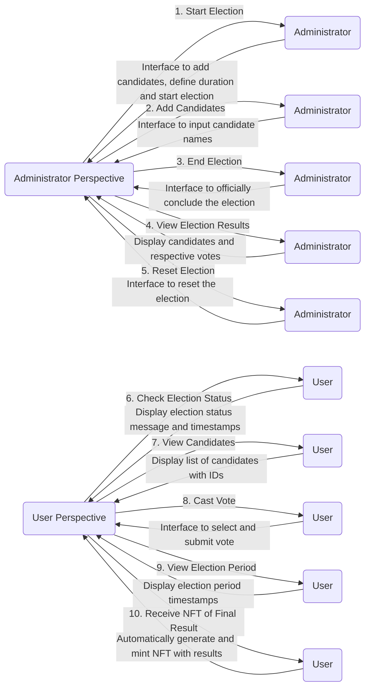
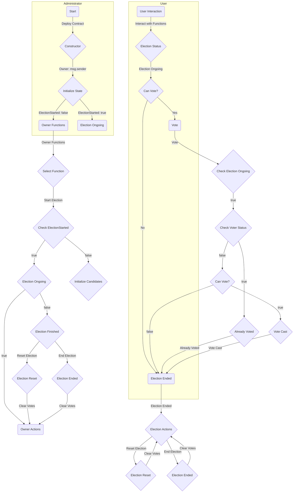

# S2BC Voting dApp Tutorial 2023 bis

## Specifications

### Stack

- Solidity
- HardHat
- Node
- Javascript
- Metamask
- Morpheus
- Oppen Zeppelin
- IPFS
- EVM testnet (private network)


---

## User Stories

### Administrator Perspective

1. **Start Election**
   - *Objective*: Enable the administrator to commence the election for voter participation.
   - *Functional Specification*: Provide an interface allowing the administrator to add candidates, define the voting duration, and initiate the election.

2. **Add Candidates**
   - *Objective*: Allow the administrator to include new candidates in the list.
   - *Functional Specification*: Provide an interface for the administrator to input candidate names.

3. **End Election**
   - *Objective*: Permit the administrator to conclude the election, preventing further votes.
   - *Functional Specification*: Offer an interface for the administrator to officially conclude the election.

4. **View Election Results**
   - *Objective*: Enable the administrator to review the results for the purpose of announcing the winner.
   - *Functional Specification*: Display the candidates along with the respective number of votes they have received.

5. **New Election**
   - *Objective*: Provide the administrator with the ability to delete and start a new election.
   - *Functional Specification*: Furnish an interface allowing the administrator to reset all variables in order to start a new election.

### User Perspective

6. **Check Election Status**
   - *Objective*: Allow the voter to determine if the election has commenced.
   - *Functional Specification*: Display a message indicating whether the election has begun or not. If started, provide the start and end timestamps of the election period.

7. **View Candidates**
   - *Objective*: Enable the voter to see the list of candidates for an informed decision.
   - *Functional Specification*: Display the names of all candidates along with their respective IDs.

8. **Cast Vote**
   - *Objective*: Enable the voter to submit their vote for a specific candidate.
   - *Functional Specification*: Provide a button or interface for the voter to select a candidate. Upon selection, process the vote.

9. **View Election Period**
   - *Objective*: Allow the voter to see the start and end timestamps of the election.
   - *Functional Specification*: Display the timestamp range for the election period.

10. **Receive NFT of Final Result**
    - *Objective*: Provide the voter with an NFT containing the final election results for verification.
    - *Functional Specification*: Upon concluding the election session through the 'End Election' action, the administrator will generate an NFT containing the election results. This NFT will then be minted and sent to the respective voter’s wallet address.

---

---


## Installation

### Create main reposetory

- Explain the process of creating a repository for version control using Git.

### Create Sub-repo back-end named "HardHat"

#### Install HardHat
##### What is hardhat?
With Hardhat, developers can compile, test and deploy their contracts. 
##### Installation

- Provide step-by-step instructions for installing HardHat.

```
npm install --save-dev hardhat

```

```
npx hardhat init```
```
```
npx hardhat compile

```
```
npx hardhat test
```

```
npx hardhat run scripts/deploy.js
```
```
npx hardhat node
```


###### Local HardHat blockchain for development

- Explain how to set up a local HardHat blockchain for development purposes.

#### Create Sub-repo front-end named "frontend"

#### Install Nextjs-React

#### What is NextJS?
- NextJS description

##### Installation

- Explain the process of setting up Next.js and React for the front-end.

```
npx create-next-app frontend
```


## Development

### Solidity - Smart Contract

#### Introduction

In this section, we will explore the fundamentals of smart contract development using Solidity. We will be creating a Voting smart contract to facilitate the voting process and an NFT to keep track of the voting results.


#### Diagram - Flow chart

- Include a flow chart diagram to visualize the flow of the smart contract.




#### Coding in Remix IDE / VScode

- Explain the process of coding the smart contract using Remix IDE or VScode.

#### Diagram - Flow chart

- Include a flow chart diagram to visualize the flow of the smart contract.

#### Coding in Remix IDE / VScode

- Explain the process of coding the smart contract using Remix IDE or VScode.

##### Contract code

- Provide a breakdown of the contract code, including the Factory contract, Main contract, and NFT contract.


###### License

- Specify the license used for the smart contract code.

###### Compiler version

- Mention the compiler version used for compiling the smart contract.

###### Contract Name

- Provide the name of the smart contract.

###### Functions

- List and explain the functions implemented in the smart contract.

###### Fallback Functions

- Explain the use of fallback functions in the smart contract.

###### Error handling - how to handle different types of errors

- Explain how to handle different types of errors in the smart contract.

###### Events

- Describe the events emitted by the smart contract.

###### Gas optimization - techniques to reduce costs

- Provide techniques and best practices for optimizing gas costs in the smart contract.


###### Mint of NFT

- Describe the process of minting NFTs in the NFT contract.

###### Link to IPFS

- Explain how to link the NFT contract to IPFS for storing NFT metadata.

#### Deployment

###### Smart-contract deployment

- Describe the process of deploying the smart contract.

###### Local HardHat blockchain deployment for testing

- Explain how to deploy the smart contract on a local HardHat blockchain for testing purposes.

###### EVM Sepolia testnet deployment

- Describe the steps to deploy the smart contract on the EVM Sepolia testnet.

#### Verify

##### Verify the contract with HardHat

- Explain how to verify the smart contract using HardHat.

##### Verify the contract on a blockchain explorer

- Provide instructions on how to verify the smart contract on a blockchain explorer like Etherscan.

---

### React-NextJS front-end

#### Install

##### Dependencies

- List the dependencies required for the React front-end.

#### User Authentication and Authorization

##### Connect Wallet button

- Explain how to implement a Connect Wallet button for user authentication.

##### Roles

- Describe the different roles and their permissions in the dApp.

#### Testing

- Explain the process of testing the React front-end.

#### Design

##### Use of MUI - Material-UI

- Explain the use of Material-UI for designing the front-end.

#### Integration

##### How the front-end interacts with the smart contract

- Describe how the front-end interacts with the smart contract using web3.js or ethers.js.

#### Testing

##### Ensuring the stability and functionality of both the smart contract and the front-end

- Why Test Smart Contracts?
Smart contracts handle sensitive operations on the blockchain, making it essential to thoroughly test them. A well-tested smart contract helps prevent vulnerabilities, ensures correct functionality, and builds confidence in the system's reliability.

- Why Test the Front-End?
Front-end testing ensures that the user interface behaves correctly and provides a seamless experience for users interacting with the dApp.


#### Deploy

- Provide instructions on how to deploy the React front-end.

---

## Security

### Security Considerations

- Discuss the security considerations for the dApp.

#### Section on security best practices

- Provide a section dedicated to security best practices, including avoiding common vulnerabilities and guidance on secure coding practices.

##### Reentrancy attacks and providing guidance on secure ownership consideration

- Explain the concept of reentrancy attacks and provide guidance on secure ownership considerations.

##### Specific examples

- Provide specific examples of common vulnerabilities and how to avoid them.

##### Links to resources on common vulnerabilities

- Include links to external resources that provide more information on common vulnerabilities.

#### Use of OpenZeppelin

- Explain the use of OpenZeppelin for secure smart contract development.

---

# Extra section

## Morpheus platform BLAAS - Blockchain As A Service

### Understand Morpheus

- Provide an overview of the Morpheus platform and its features.

### Create RPC link to connect to blockchain

- Explain howto create an RPC link to connect to the blockchain using Morpheus.

### Interact with Git repo

- Explain how to interact with the Git repository that contains the source code of the tutorial.

## Git repo with source code of the tutorial

### Source code

- Provide a link to the Git repository where the source code of the tutorial is hosted.

### Live demo link of the Voting dApp

- Provide a link to a live demo of the Voting dApp for users to try out.

## Link of interest

- Provide a list of relevant links that users may find useful for further exploration.

### HardHat

- Link to the official HardHat documentation or website.

### Next.js

- Link to the official Next.js documentation or website.


### Node

- Link to the official Node.js documentation or website.

### Remix IDE

- Link to the Remix IDE documentation or website.

### VSCode

- Link to the official Visual Studio Code documentation or website.

### Etherscan

- Link to the Etherscan website for verifying and exploring smart contracts.

### Metamask

- Link to the Metamask website or documentation for information on the Ethereum wallet.

---

# Documentation

## Back-end documentation

- Provide documentation specifically for the back-end implementation, including the smart contract code and deployment instructions.

## Front-end documentation

- Provide documentation specifically for the front-end implementation, including installation instructions and details on how to interact with the dApp.